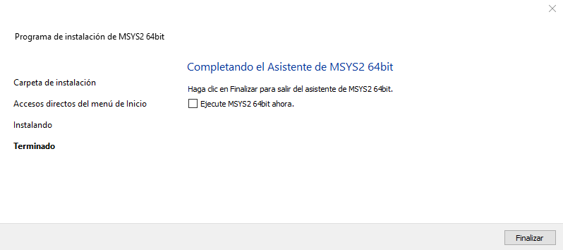
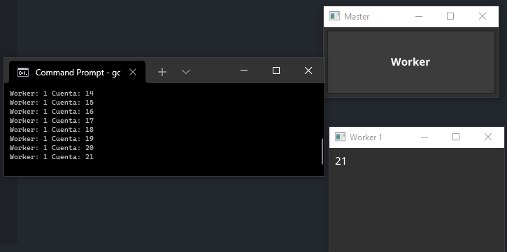

# Test_Bernardo_Go
## 1. Configuración del entorno
* El programa funciona por medio de una interfaz gráfica con el uso de **Fyne**.
* Fue desarrollado y probado en una computadora a **64bits** con **Windows 10** corriendo como sistema operativo.
* ### Requerimientos
* Go
* Compilador de C **MSYS2**
  * #### Instrucciones de instalacion de **MSYS2** para **Windows**
  1. Descargar el instalador del siguiente enlace [msys2.org](https://www.msys2.org/)
  2. Ejecutar el instalador
  3. Una vez instalado no utilizar el MSYS2 que se abre automaticamente. Y dar a finalizar.  
   
      
  
  4. Abrir "MSYS2 MinGW 64-bit" desde el menu de inicio.  

    

  5. Ejecutar las siguientes lineas de comando (si se le pregunta sobre opciones de instalación, elegir "all")
   
     

  6. Añadir a la variable de entorno `PATH` la ruta `/bin` donde se haya instalado **MSYS2** (la ruta por defecto definida en el instalador es `C:\msys64`)

    
    
    * #### Si se requiriera la instalación de MSYS2 en otro systema operativo se pueden seguir las instrucciones descritas en la misma documentacion de [**Fyne**](https://developer.fyne.io/started/)  

## 2. Dependencias  
Como se mencionó anteriormente, el programa hace uso del modulo externo **Fyne** y de todas sus dependecias, por lo tanto, se debe de hacer uso de los comandos `go get fyne.io/fyne` y `go mod tidy` en ese orden, dentro de la carpeta del proyecto para descargarlas.

## 3. Ejecución
La ejecución se realiza por medio del comando `go run .` estando en la raíz del proyecto.  
Se compilará y ejecutará el código.  

## 4. Funcionamiento

#### El programa funciona por medio de una interfaz gráfica y la terminal.

#### 4.1 Primera vista

Al iniciar el programa se mostrará la siguiente ventana, la cuál es el proceso principal.  

#### 4.2 Ejecución del primer worker
Al presionar el boton **Worker** se creará un *worker*, el cuál es una ventana hija de la ventana principal. El *worker* lleva dentro un proceso totalmente independiente al proceso principal, un conteo ascendente empezando en el 1.  

  

Como se podrá observar, el conteo del *worker* también se puede ver en la terminal.

#### 4.3 Ejecución de multiples workers
Se pueden crear tantos *workers* se deseé, presionando el botón **Worker**.  
Cada worker ejecutará su proceso (conteo) independientemente, y podrá ser visualizado también en la terminal.

#### 4.4 Eliminación de workers
Como se mencionó anteriormente, cada *worker* corre en un proceso independiente, pero aun así, cada worker mantiene comunicación con el proceso principal ya que, al cerrar a un *worker* éste deja de ser tomado en cuenta también por el proceso principal, por lo que su conteo dejará de estar presente en la terminal.  

  

En la imagen anterior se puede observar que el conteo del worker 2 ya no aparece en el registro del proceso principal, ya que la ventana fue cerrada.

#### 4.5 Finalización del programa
Para detener la ejecución del programa basta con cerrar el proceso principal (ventana principal), si hay workers vivos estos se cerrarán automaticamente también.  